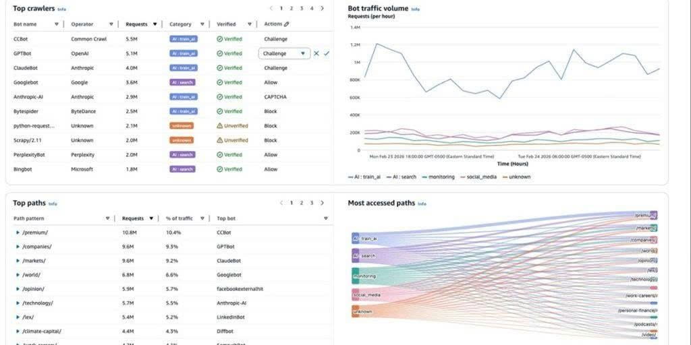

{}
⚠️ **Lưu ý:** Các thông tin dưới đây chỉ nhằm mục đích tham khảo, vui lòng **không sao chép nguyên văn** cho bài báo cáo của bạn kể cả warning này.
{}

# TÌM HIỂU AI TRAFFIC ANALYSIS DASHBOARDS TRONG AWS WAF

AWS WAF vừa giới thiệu tính năng mới có tên AI Traffic Analysis Dashboards, giúp đội ngũ vận hành quan sát và phân tích riêng biệt lượng truy cập đến từ các hệ thống AI (AI crawlers/agents) thay vì gộp chung với traffic từ bot truyền thống. Đây là phản ứng của AWS trước xu hướng ngày càng nhiều AI crawler (như của các hệ thống chatbot, công cụ tìm kiếm AI) truy cập website để thu thập dữ liệu hoặc phục vụ tra cứu, dù các request này không mang tính tấn công nhưng vẫn tiêu tốn tài nguyên hệ thống.

Các điểm chính cần nắm:

* Dashboard giúp nhận diện những hệ thống AI cụ thể nào đang truy cập vào ứng dụng (ví dụ: các crawler của OpenAI, Anthropic, Perplexity...), thay vì chỉ hiển thị tổng số request chung chung.
* Việc nhận diện bot không chỉ dựa vào User-Agent (vì thông tin này có thể bị giả mạo) mà AWS WAF Bot Control còn dùng thêm cơ chế xác thực để định danh chính xác hơn.
* Dashboard thống kê được những URL/endpoint nào (trang blog, tài liệu kỹ thuật, API, trang sản phẩm...) đang bị AI truy cập nhiều nhất, giúp đội vận hành biết khu vực nào chịu tải AI traffic lớn để áp dụng rate limiting hoặc cache phù hợp.
* Hỗ trợ theo dõi xu hướng AI traffic theo thời gian: traffic tăng/giảm, bot nào hoạt động nhiều nhất, thời điểm phát sinh các đợt truy cập bất thường.
* Mục tiêu của tính năng không phải để chặn AI truy cập, mà để doanh nghiệp có cái nhìn rõ ràng, minh bạch hơn về loại lưu lượng này trên hệ thống của mình.

Tính năng này cho thấy các dịch vụ bảo mật cloud đang dần xem AI traffic như một loại lưu lượng riêng cần được giám sát độc lập, thay vì gộp chung với các cuộc tấn công hay bot spam như trước đây — phản ánh xu hướng ngày càng nhiều AI agent tham gia vào hoạt động khai thác dữ liệu web.

...Hình ảnh...

Link bài viết gốc: <https://aws.amazon.com/blogs/security/introducing-ai-traffic-analysis-dashboards-for-aws-waf/>

Link bài viết : <https://www.facebook.com/share/p/17gDGfkYyX/>
