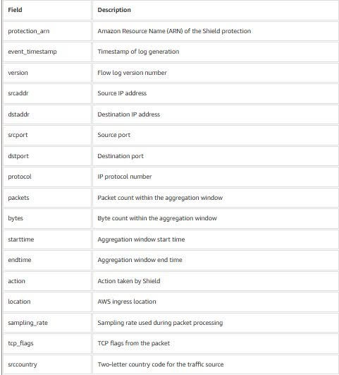

{}
⚠️ **Note:** The information below is for reference only. Please **do not copy it verbatim** into your report, including this warning.
{}

# AWS SHIELD ADVANCED ATTACK FLOW LOGS FOR DDoS ATTACK MONITORING

AWS Shield Advanced has recently introduced the **Attack Flow Logs** feature, which provides detailed logging of network traffic during Distributed Denial-of-Service (DDoS) attacks. This enhancement enables security and operations teams to investigate incidents using detailed traffic data instead of relying solely on high-level metrics as in the past.

## Key Takeaways

* AWS Shield Advanced is an advanced DDoS protection service that safeguards AWS resources such as Amazon CloudFront, Elastic Load Balancing (ELB), Amazon Route 53, AWS Global Accelerator, and Elastic IP. It is capable of detecting and mitigating attacks at both the network and transport layers.

* Attack Flow Logs capture traffic metadata during DDoS attacks and allow the collected data to be exported to Amazon S3, Amazon CloudWatch Logs, or Amazon Data Firehose for integration with existing monitoring and analytics systems.

* The logged information includes source and destination IP addresses, network protocols, packet and byte counts, the country where the traffic originated, the AWS Edge Location that received the traffic, and the mitigation action taken by AWS Shield.

* The primary benefits include detailed analysis of attack traffic volume and characteristics, identifying attack sources based on IP addresses or geographic locations, and evaluating the effectiveness of mitigation mechanisms through the recorded **action** field.

* The collected logs can be analyzed using services such as Amazon Athena, CloudWatch Logs Insights, or integrated with Security Information and Event Management (SIEM) platforms such as Splunk for advanced security investigations.

## Personal Reflection

This feature demonstrates that effective DDoS protection is not limited to detecting and mitigating attacks. The ability to observe, analyze, and investigate traffic after an incident is equally important for understanding the attack's impact and continuously improving an organization's security posture.

## Illustration

## References

Original AWS Blog:

<https://aws.amazon.com/vi/blogs/security/gain-visibility-into-ddos-attacks-with-flow-logs-in-aws-shield-advanced/>

Reference Article:

<https://www.facebook.com/groups/660548818043427/user/100010448557887>